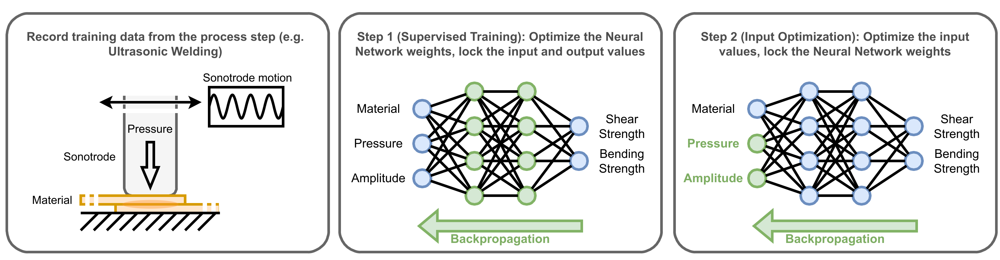

[](https://www.python.org/downloads/release/python-380/)
[](https://mamba.readthedocs.io)
[](https://pytorch.org/)
[](LICENSE)

# param-opt

Welcome to the p-opt repository. 
This repository features a Machine Learning approach toward estimating process paramaters for production steps.

The approach consists of two steps: (i) Training a Neural Network to approximate the process step on observations from a Design of Experiment (DoE) or data from the production process, 
(ii) Using gradient descent and backpropagation of the output error to not optimize the weights of the Neural Network, but its input parameters. 
Thereby, we can leverage on the functional dependencies between inputs-parameters and outputs and additionally include contextual information for pushing the optimization process into the global optimum. 

The approach is mainly based on an idea from [Wu et al.](https://proceedings.neurips.cc/paper_files/paper/2017/file/98b17f068d5d9b7668e19fb8ae470841-Paper.pdf).
A derivation of the approach for time-series data has been applied here [Roche et al. 2024](https://doi.org/10.1007/s42979-025-03798-5).
This repository contains the code for applying the method on numerical feature vectors.

The figure below shows the idea of the algorithm using data from Ultrasonic Welding DoEs, which we evaluated in our [paper]().




## Table of Contents

- [Installation](#installation)
- [Results](#results)
- [Replication](#replication)
- [Citation](#citation)
- [License](#license)


## Installation

To install the required packages and dependencies, run the following commands: 
```bash
mamba env create -f paramopt.yml
```
This code has been tested and run on Ubuntu Desktop 22.04 LTS and 24.04 LTS. 

## Results 

We conducted four experiments to evaluate our approach on finding the optimal parameters using a 0.9/0.1 train/test split on our datasets and k-fold cross-validation. 

- Experiment 1: As prerequisite, we evaluted the capability the Neural Networks to fit the training data. 
- Experiment 2: We evaluated different optimizers and their convergence behavior. 
- Experiment 3: We benchmarked our algorithm against a semi-informed (beam-search) and uninformed (genetic algorithm) search paradigm.
- Experiment 4: We tested the transferability of pre-trained models across different datasets. 

The GIFs below show the second step of our approach for finding one or two optimal parameters. 

| This is an example for finding only one parameter | This is an example for finding two parameters    |
|---------------------------------------------------|--------------------------------------------------|
|               |            |


## Citation
If you use this algorithm, make sure to cite our publication: 
````bibtex

````

## License 

This project is licensed under the MIT License - see the [LICENSE](LICENSE) file for details.
