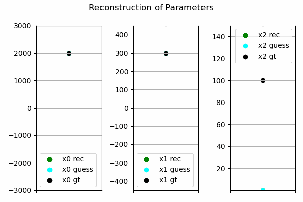
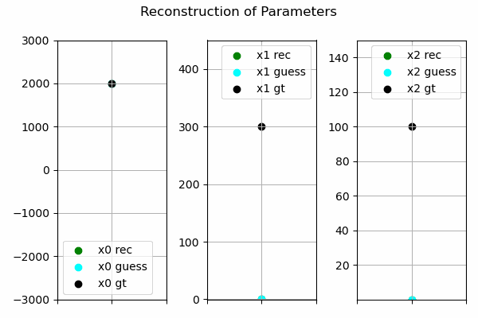

[](https://www.python.org/downloads/release/python-380/)
[](https://mamba.readthedocs.io)
[](https://pytorch.org/)
[](LICENSE)

# paramOpt

This is the repository to our paper

> **Using Gradient-based Optimization for Estimating Process Parameters — A Case Study in Ultrasonic Welding**  
> Jonas Ehrhardt, René Heesch, Björn Ludwig, Sophie Arweiler, Moritz Liesegang, Oliver Niggemann  
> [Paper link coming soon]()

**paramOpt** is a gradient-based optimization framework for estimating process parameters from desired product quality specifications.


## Overview

Finding suitable process parameters is a central challenge in manufacturing.  In many production processes, the forward relationship is known only through data:

**process parameters** → **product quality**

However, engineers are often interested in the inverse problem:

**desired product quality** → **suitable process parameters**

Since this inverse mapping is generally nonlinear, ill-posed, and not available in closed form, paramOpt solves it by combining supervised learning with gradient-based input optimization in a two step algorithm: 

*(i) Forward model training*
A neural network is trained on historical process data, such as Design of Experiment DoE studies, to approximate the mapping from process parameters to quality characteristics.
*(ii) Input optimization*
The trained neural network is kept fixed. Instead of optimizing the network weights, paramOpt optimizes selected input parameters so that the model prediction matches a desired target quality.

This makes it possible to exploit the learned functional dependency between process parameters and quality characteristics while searching efficiently in continuous parameter spaces.

## Method

The repository includes two variants of paramOpt: $paramOpt_{wb}$ and $paramOpt_{bb}$. 

### $paramOpt_{wb}$: white-box optimization

For locally available models with access to weights and gradients, paramOpt directly backpropagates the prediction error to the input parameters.

### $paramOpt_{bb}$: black-box optimization

For models where gradients are not available, for example hosted foundation models, paramOpt approximates gradients using finite differences. This enables input optimization even when model internals are inaccessible.

## Case Study: Ultrasonic Welding

We evaluate paramOpt on process parameter estimation for Ultrasonic Welding.The datasets contain six real-world Design of Experiment studies from two welding processes: *Continuous Roll Seam Ultrasonic Welding* and *Torsional Ultrasonic Welding*.

## Experiments

The paper evaluates paramOpt in five experiments:

1. **Forward model fitting**: We compare neural network architectures and a tabular foundation model for learning the mapping from process parameters to lap shear strength.

2. **Optimizer comparison**: We evaluate different gradient-based optimizers for the second step of paramOpt, including SGD, ASGD, SGD with Nesterov momentum, Adam, and RMSprop.

3. **Comparison with search baselines**: We benchmark paramOpt against uninformed and heuristic search methods, including a genetic algorithm and beam search.

4. **White-box vs. black-box optimization**: We compare exact gradients from backpropagation with finite-difference gradient approximations.

5. **Real-world validation**: We validate an optimized parameter set experimentally in a Continuous Roll Seam Ultrasonic Welding setup.

Overall, the results show that gradient-based parameter estimation can converge faster than search-based baselines and can identify non-intuitive parameter combinations that outperform conventionally estimated process parameters.

The following GIFs illustrate the second optimization step of paramOpt.

| This is an example for finding only one parameter | This is an example for finding two parameters |
| ------------------------------------------------- | --------------------------------------------- |
|               |           |

## Citation

If you use this algorithm, make sure to cite our publication: 
```bibtex

```

## License

This project is licensed under the MIT License - see the [LICENSE](LICENSE) file for details.
