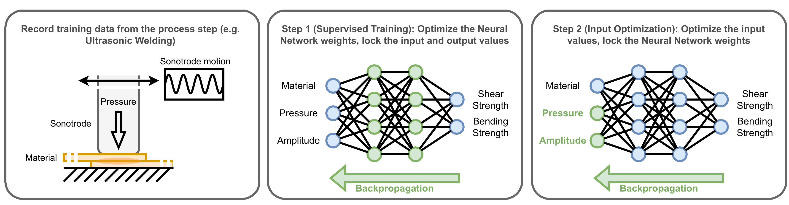
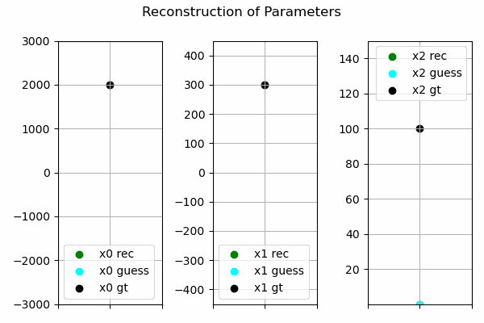
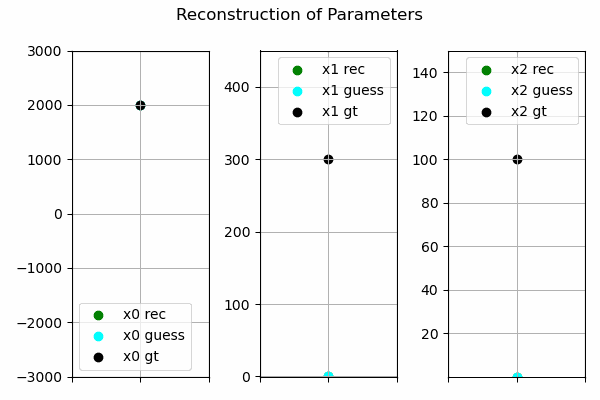

[](https://www.python.org/downloads/release/python-380/)
[](https://mamba.readthedocs.io)
[](https://pytorch.org/)
[](LICENSE)

# paramOpt

**paramOpt** is a gradient-based optimization framework for estimating process parameters from desired product quality specifications.



## Overview

Finding suitable process parameters is a central challenge in manufacturing.  In many production processes, the forward relationship is known only through data:

**process parameters** → **product quality**

However, engineers are often interested in the inverse problem:

**desired product quality** → **suitable process parameters**

Since this inverse mapping is generally nonlinear, ill-posed, and not available in closed form, paramOpt solves it by combining supervised learning with gradient-based input optimization in a two step algorithm: 

*(i) Forward model training*
A neural network is trained on historical process data, such as Design of Experiment DoE studies, to approximate the mapping from process parameters to quality characteristics.
*(ii) Input optimization*
The trained neural network is kept fixed. Instead of optimizing the network weights, paramOpt optimizes selected input parameters so that the model prediction matches a desired target quality.

This makes it possible to exploit the learned functional dependency between process parameters and quality characteristics while searching efficiently in continuous parameter spaces.

paramOpt supports two optimization objectives through `OPT_OBJECTIVE`:

- `target_match` minimizes the prediction error against a requested quality target.
- `maximize` maximizes the surrogate's predicted quality directly. This is the open-loop formulation used to propose promising parameter combinations for physical validation.

In both modes, only parameters selected by `FOR_OPT_PARAMS` are changed. Every method is projected onto the same configured physical bounds; when no bounds are supplied, paramOpt deterministically uses the bounds of the complete cleaned DoE.

## Method

The repository includes two variants of paramOpt: $paramOpt_{wb}$ and $paramOpt_{bb}$. 

### $paramOpt_{wb}$: white-box optimization

For locally available models with access to weights and gradients, paramOpt directly backpropagates the prediction error to the input parameters.

### $paramOpt_{bb}$: black-box optimization

For models where gradients are not available, for example hosted foundation models, paramOpt approximates gradients using finite differences. This enables input optimization even when model internals are inaccessible.

The black-box implementation uses the TabPFN 2.5 regressor. The environment installs the `tabpfn` package and the code explicitly selects its `V2_5` model version, so it does not silently move to the package's default model. TabPFN downloads its model weights on first use; these are cached outside this repository and are not tracked here. Access to the TabPFN 2.5 weights requires accepting Prior Labs' model license.

## Setup

Create a fresh Python 3.12 environment and install the project dependencies with `python -m pip install -r requirements.txt`. TabPFN can run on CPU for these small datasets, although GPU inference is generally faster. If a specific CUDA build is required, install the matching PyTorch 2.5.1 wheel first, then install the remaining requirements.

## Case Study: Ultrasonic Welding

We evaluate paramOpt on process parameter estimation for Ultrasonic Welding.The datasets contain six real-world Design of Experiment studies from two welding processes: *Continuous Roll Seam Ultrasonic Welding* and *Torsional Ultrasonic Welding*.

## Experiments

The paper evaluates paramOpt in three experiments:

1. **Search-baseline comparison**: We benchmark paramOpt against a genetic algorithm and beam search when reconstructing machine parameters for a requested quality target.

2. **White-box versus black-box optimization**: We compare exact gradients from backpropagation with finite-difference approximations using a TabPFN surrogate.

3. **Real-world validation**: The paper reports an experimentally validated open-loop parameter set in a Continuous Roll Seam Ultrasonic Welding setup. The repository can generate open-loop proposals, but physical validation requires a welding experiment and is not represented as a software-only result.

Overall, the results show that gradient-based parameter estimation can converge faster than search-based baselines and can identify non-intuitive parameter combinations that outperform conventionally estimated process parameters.

### Run code

To run paramOpt and the baselines call the following

```bash
python code/eval.py --suite baselines
python code/eval.py --suite gradients
```

The following GIFs illustrate the second optimization step of paramOpt (gt = ground truth, rec = estimated parameter values, guess = optimization starting value).

| This is an example for finding only one parameter | This is an example for finding two parameters |
| ------------------------------------------------- | --------------------------------------------- |
|               |           |

## Citation

If you use this algorithm, make sure to cite our publication: 
```bibtex

```

## License

This project is licensed under the MIT License - see the [LICENSE](LICENSE) file for details.
